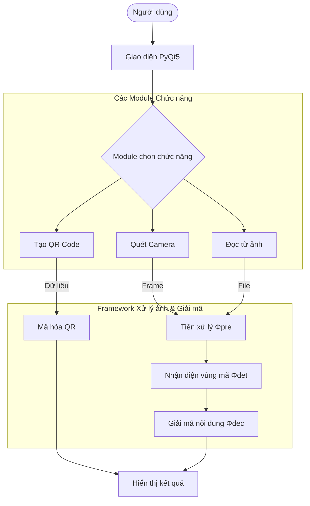

# QR & BARCODE STUDIO: Ứng dụng tạo và đọc QR Code, xác định vùng ảnh chứa QR Code và Barcode trong tài liệu ảnh
# Thái Hữu Tài, Nguyễn Chí Linh, Nguyễn Ngọc Hải Yến, Huỳnh Chí Nguyễn, Huỳnh Ngọc Quý, Thái Quốc Đúng
# {thaihuutai04082005, nguyeenxchislinh, nguyenngochaiyen945, huynhvannguyen695, huynhngocquy01012019, quocdungthai56} @gmail.com
# Tóm tắt
  QR Code và Barcode là các công nghệ mã hóa thông tin được sử dụng rộng rãi trong quản lý dữ liệu, thanh toán điện tử và truy xuất thông tin. Trong đề tài này, nhóm chúng em phát triển ứng dụng QR & BARCODE STUDIO, cho phép tạo và đọc QR Code, đồng thời xác định vùng ảnh chứa QR Code và Barcode trong các tài liệu ảnh.

  Ứng dụng hỗ trợ quét mã thông qua camera thời gian thực hoặc tải ảnh từ thiết bị, tự động phát hiện vị trí mã trong ảnh, tiến hành giải mã và hiển thị nội dung tương ứng. Hệ thống được xây dựng nhằm đảm bảo tính chính xác, tốc độ xử lý nhanh và giao diện thân thiện với người dùng. Kết quả thực nghiệm cho thấy ứng dụng có khả năng nhận diện tốt trong nhiều điều kiện khác nhau và đáp ứng hiệu quả nhu cầu học tập cũng như ứng dụng thực tiễn.
# Từ khóa
QR Code · Barcode · Xử lý ảnh · Thị giác máy tính · Nhận dạng mã
# Công nghệ sử dụng
- Python 3.11.x
- OpenCV
- PyQt5
- Thư viện QRCode / ZBar
# Khung làm việc:

# Thuật toán
Algorithm 1: QR & Barcode Detection and Decoding

Input:
    I: Image or Camera frame
    D: Text data (for QR Code generation)
    Φpre: Image preprocessing functions
    Φdet: QR/Barcode detection function
    Φdec: QR/Barcode decoding function

Output:
    R: Generated QR Code or Decoded content

begin
    R ← ∅

    // Step 1: User selects function
    if Function = Generate QR Code then
        R ← Encode(D)
        Display(R)

    else if Function = Scan by Camera then
        while Camera is active do
            I ← Capture frame
            Igray ← Φpre(I)
            ROI ← Φdet(Igray)

            if ROI ≠ ∅ then
                R ← Φdec(ROI)
                Display(R)
                break
            end if
        end while

    else if Function = Read from Image then
        Igray ← Φpre(I)
        ROI ← Φdet(Igray)

        if ROI ≠ ∅ then
            R ← Φdec(ROI)
            Display(R)
        else
            Display("No QR/Barcode detected")
        end if
    end if

    return R
end
# Độ phức tạp thời gian tổng thể
Đối với quá trình phát hiện và đọc mã QR Code / Barcode:
- Tiền xử lý ảnh (chuyển ảnh xám, lọc nhiễu): O(n).
- Xác định vùng ảnh chứa mã QR Code / Barcode: O(n).
- Giải mã nội dung mã: O(k).

➡️ Độ phức tạp tổng thể xấp xỉ:
O(n + k)

Trong đó:
- n là số lượng pixel của ảnh đầu vào
- k là độ dài dữ liệu được mã hóa trong QR Code hoặc Barcode
# Các yếu tố ảnh hưởng
- Độ phân giải và chất lượng ảnh đầu vào.
- Điều kiện ánh sáng và mức độ nhiễu của ảnh.
- Kích thước, độ rõ nét và mức độ che khuất của mã.
- Thuật toán phát hiện và giải mã được sử dụng.
# Kết quả

